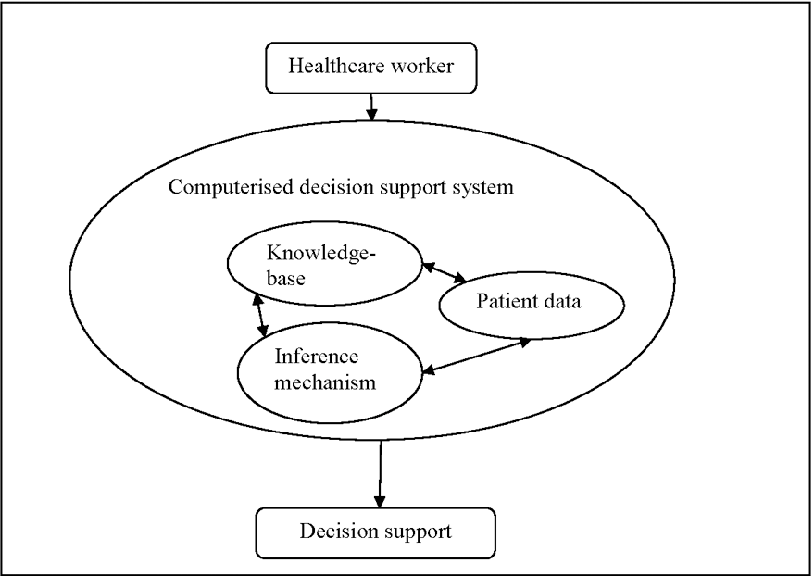
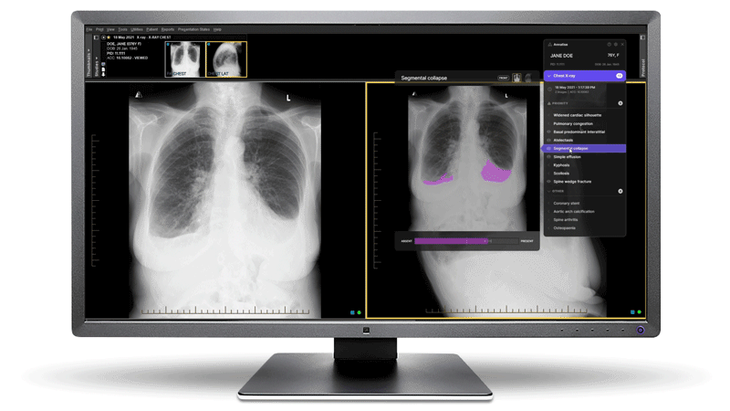
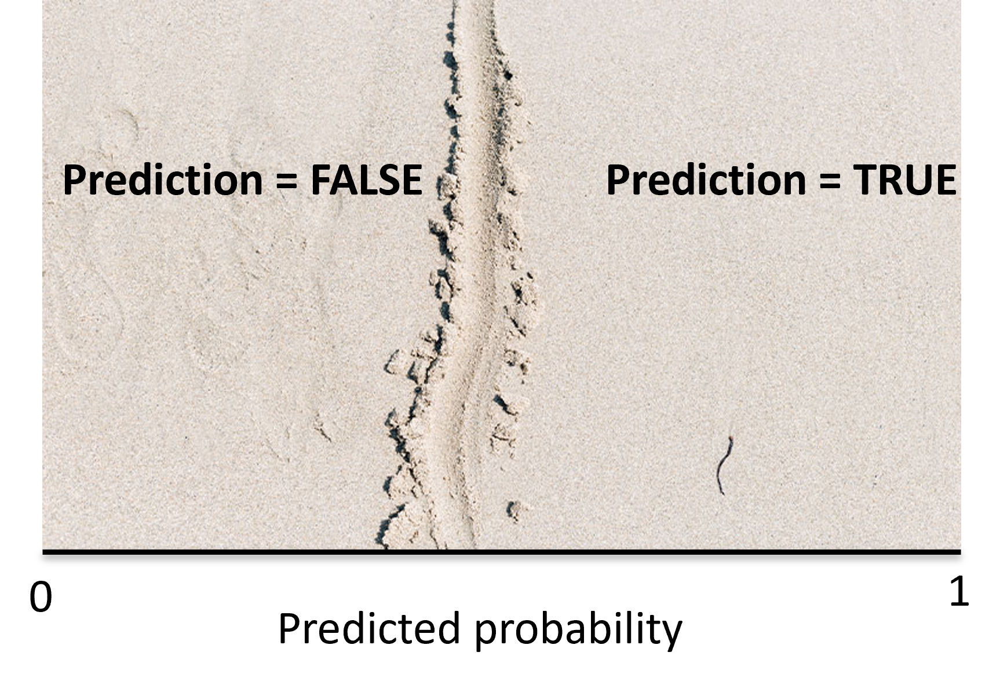
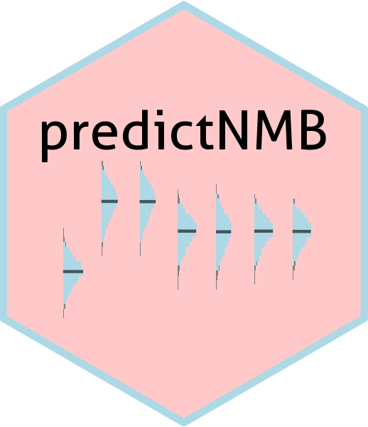

```{r setup, include=FALSE}
knitr::opts_chunk$set(echo = FALSE)
```

```{css, echo=FALSE}
.imgcenter {
  display: block;
  margin-left: auto;
  margin-right: auto;
  width: 75%;
}

.remark-container {
  height: 600px!important;
  width: 900px!important;
}

.remark-code {
  font-size: 80%
}

iframebody {
  position: fixed;
  top: 0;
  left: 0;
  right: 0;
  bottom: 0;
  margin:0;
  overflow: hidden;
  padding: 0;
}
	
iframe {
  height: 100vh;
  width: 100vw;
}

```


## What is a CDSS?

--

### ???

--

.pull-left[
- System that support/improves clinical decisions
- Reduces large amount of information into something digestible
- Communicate that information to the clinician in a way that improves decision making (ideally)
]

.pull-right[

]

---

## What is a CDSS?

#### annalise.ai's chest x-ray decision support

.pull-left[
- Assesses chest x-ray for 124 possible outcomes
- Ranks outcomes and communicates risk to user
- Highlights areas of image that are influential to risk estimate
]

.pull-right[
- clinical prediction model
- reduces/prioritises information
- model interpretation for better decision (?)
]

<p style="text-align:center;">
  
</p>

---

## What is a CDSS?

#### annalise.ai's chest x-ray decision support

.pull-left[
- **Assesses chest x-ray for 124 possible outcomes**
- **Ranks outcomes and communicates risk to user**
- Highlights areas of image that are influential to risk estimate
]

.pull-right[
- **clinical prediction model**
- **reduces/prioritises information**
- model interpretation for better decision (?)
]

<p style="text-align:center;">
  
</p>

---

## What is a clinical prediction model?

#### Diagnostic


---

## What is a clinical prediction model?

#### Prognostic

.pull-left[

]
--
.pull-right[

]

---

## How should outputs from a clinical prediction model be shown?

<center>
```{r, fig.align='center', echo=FALSE}
DiagrammeR::grViz("digraph {
  graph [layout = dot, rankdir = TB]
  
  node [shape = oval, fontname = Cabin]        
  n1 [label = 'Patient data']
  n2 [label = 'Prediction model']
  n3 [label =  '???', color='red']
  n4 [label = 'PROFIT\n(better value care)']
  
  # edge definitions with the node IDs
  n1 -> n2 -> n3 -> n4
  }",
  height = 450)
```
</center>

---

#### annalise.ai's chest x-ray decision support

.pull-left[
- Assesses chest x-ray for 124 possible outcomes
- **Ranks outcomes and communicates risk to user**
- Highlights areas of image that are influential to risk estimate
]

.pull-right[
- clinical prediction model
- **reduces/prioritises information**
- model interpretation for better decision (?)
]

<p style="text-align:center;">
  
</p>

---

## How should outputs from a clinical prediction model be shown?


*your thoughts?*

--

- Predicted probabilities

--

- Predicted classes (cancer vs no-cancer)

--

- 🚦 Traffic lights or other (ordinal) larger scale


---

## Cutpoints

<center>
```{r, fig.align='center', echo=FALSE}
DiagrammeR::grViz("digraph {
  graph [layout = dot, rankdir = TB]
  
  node [shape = oval, fontname = Cabin]        
  n1 [label = 'Predicted probabilities (between 0 and 1)']
  n2 [label = 'Cutpoint']
  n3 [label =  'Predicted classes (0 or 1)']
  
  # edge definitions with the node IDs
  n1 -> n2 -> n3
  }",
  height = 450)
```
</center>

---

## Cutpoints
.imgcenter[

]

---

## Cutpoints
.imgcenter[

]

---

## Cutpoints

<iframebody>
  <iframe src="https://aushsi.shinyapps.io/cost-effective-cpms-app/"  frameborder="0" </iframe>
</iframebody>

---

## Optimising cutpoints for clinical decisions

<center>
```{r, fig.align='center', echo=FALSE}
DiagrammeR::grViz("digraph {
  graph [layout = dot, rankdir = TB]
  
  node [shape = oval, fontname = Cabin]        
  n1 [label = 'Predicted probabilities (between 0 and 1)']
  n2 [label = 'Cutpoint']
  n3 [label =  'Predicted classes (0 or 1)']
  n4 [label =  '(Predicted class = 1)\nPatient recieves intervention']
  n5 [label =  '(Predicted class = 0)\nPatient recieves no intervention']
  
  # edge definitions with the node IDs
  n1 -> n2 -> n3
  n3 -> {n4, n5}
  }",
  height = 450)
```
</center>


---

## Cutpoint example

#### CDSS for inpatient fall prevention

- Outcome: inpatient fall
- Treatment: patient education
- Cost of outcome: $2000 (considers quality-adjusted life years lost and additional treatment costs)
- Cost of treatment: $50
- Treatment effect: 30% reduction in risk

--

```{r}
library(predictNMB)
get_nmb <- get_nmb_sampler(
  outcome_cost = 2000, 
  high_risk_group_treatment_effect = 0.3, 
  high_risk_group_treatment_cost = 50,
  low_risk_group_treatment_effect = 0,
  low_risk_group_treatment_cost = 0
)
get_nmb()
```

--

- Rate of falls in acute care hospital: 3%
- Prediction model performance: 0.75 AUC

---

<iframebody>
  <iframe src="https://aushsi.shinyapps.io/cost-effective-cpms-app/"  frameborder="0" </iframe>
</iframebody>

---

## How do we know whether a CDSS will be useful?

(currently) Evaluate in a clinical trial and perform a health-economic evaluation

(soon) Simulate the model, intervention(s), patients and decisions based on the literature

---

## predictNMB <a href='https://rwparsons.github.io/predictNMB/'></a>

- Makes performing this simulation easy
- Allows sensitivity analyses across possible values for prevalence, model performance, treatment effectiveness/costs

---

## predictNMB <a href='https://rwparsons.github.io/predictNMB/'></a>

#### Inpatient falls example

```{r, echo=F}
# sim_object <- readRDS("input/sim_object.rds")
# plot(sim_object, dodge_width = 0.01)
# ggplot2::ggsave("www/sim_screen.jpeg", height = 5, width = 8, dpi = 1200)
```


````r
sim_object <- screen_simulation_inputs(
  n_sims=500, n_valid=10000, 
  sim_auc = seq(0.6, 0.9, 0.05),
  cutpoint_methods = c("all",
                       "none",
                       "youden",
                       "value_optimising"),
  fx_nmb_training = get_nmb, 
  fx_nmb_evaluation = get_nmb,
  event_rate = 0.03,
  cl = makeCluster(detectCores())
)
plot(sim_object)
````

---
<p style="text-align:center;">
  
</p>
---

## Summary

- CDSS should support clinical decisions to be better (&uarr; value care)

--

- Objective of CDSS (&uarr; value of care) should be integrated into clinical prediction model development (cutpoint selection)

--

- CDSS which improve value-based are rare

--

- Clinical prediction model development should be prioritised towards high-value areas

---

## Thank you


@Rex_Parsons8


@RWParsons


[rwparsons.github.io/](https://rwparsons.github.io/)


[aushsi.shinyapps.io/cost-effective-cpms-app/](https://aushsi.shinyapps.io/cost-effective-cpms-app/)


[rwparsons.github.io/predictNMB/](https://rwparsons.github.io/predictNMB/)

Cost-effective cutpoints [github.com/RWParsons/cost-effective-cpms](https://github.com/RWParsons/cost-effective-cpms)

slides [rwparsons.github.io/PUB358-guest-lecture/](https://rwparsons.github.io/PUB358-guest-lecture/)


